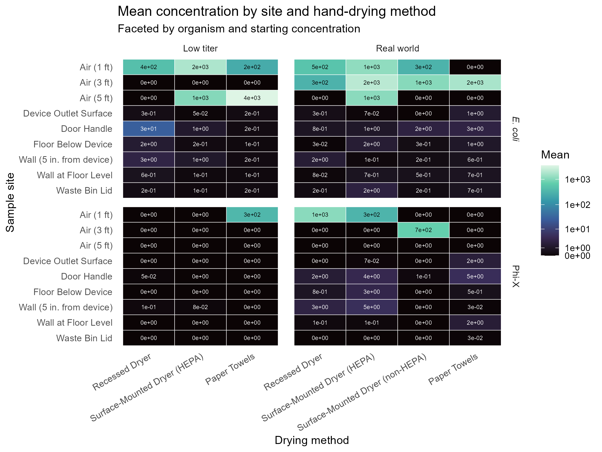

```{r}
#| code-fold: true
#| code-summary: "Show code - package loading"

#Install packman once in Console:
#install.packages("pacman")

pacman::p_load(
  readxl,
  tidyverse,
  janitor,
  truncdist,
  scales, 
  ggtext,
  forcats,
  gt,
  EnvStats
  )
```

```{r}
iterations <- 10000
set.seed(103106)
```

## Data

```{r}
#| label: data-loading
#| code-fold: true
#| code-summary: "Show code - data loading and clean up"

data <- read_excel("1.0 data.xlsx")

#data cleanup
data <- data |>
  janitor::clean_names() |> #remove spaces, special characters from headers
   dplyr::select(where(~ !all(is.na(.)))) |> #remove empty columns
  drop_na()
  
#add sample location details
sample_detail <- tibble::tibble(
  sample_id=1:9,
  sample_desc=c(
    "Air (1 ft)",
    "Air (3 ft)",
    "Air (5 ft)",
    "Device Outlet Surface",
    "Waste Bin Lid",
    "Door Handle",
    "Floor Below Device",
    "Wall (5 in. from device)",
    "Wall at Floor Level"
  )
)

device_descriptive <- tibble::tribble(
  ~dry_type, ~device_desc,
  "papertowel", "Paper towel",
  "recessed", "Hand dryer (recessed)",
  "unrecessed", "Hand dryer (surface-mounted, HEPA)",
  "nonhepa", "Hand dryer (surface-mounted, non-HEPA)",
)

data_long <- data |>
  pivot_longer(
    cols = air_1_ft:wall_floor,  
    names_to = "sample_site",
    values_to = "concentration"
  )

data_long <- data_long |>
  mutate(sample_id = match(sample_site, unique(sample_site))) |>
  left_join(sample_detail, by = "sample_id")

```

#### Surface Concentrations

Note: 10 cm^2^ areas were sampled, a conversion for 1 cm^2^ assumed contact area with fingertip was completed within the data spreadsheet. Air samples were also previously converted from per liter to m^3^.

```{r}
#| code-fold: true
#| code-summary: "Show code - helper function"

#helper function
get_surface_means <- function(org_filter, conc_filter){
  data_long |>
    filter(organism == org_filter, scenario == conc_filter) |>
    left_join(device_descriptive, by = "dry_type") |>
    group_by(sample_desc, device_desc) |>
    summarise(device_mean = mean(concentration), .groups = "drop") |>
    pivot_wider(names_from = c("device_desc"), values_from = device_mean, values_fill = 0)
}
```

```{r}
#| code-fold: true
#| code-summary: "Show code - organize values by surface and organism"

get_surface_value <- function(data, surface, device) {
  data |> 
    filter(sample_desc == surface) |> 
    pull(all_of(device))
}

surface_means_phix_real <- get_surface_means("phix", "realworld")
surface_means_phix_low <- get_surface_means("phix", "lowtiter")
surface_means_ecoli_real <- get_surface_means("ecoli", "realworld")
surface_means_ecoli_low <- get_surface_means("ecoli", "lowtiter")


# PHIX — REAL WORLD

c_phix_rw_handle_recessed   <- get_surface_value(surface_means_phix_real, 
                                                 "Door Handle", 
                                                 "Hand dryer (recessed)")
c_phix_rw_dispenser_recessed <- get_surface_value(surface_means_phix_real, 
                                                  "Device Outlet Surface", 
                                                  "Hand dryer (recessed)")
c_phix_rw_handle_surface    <- get_surface_value(surface_means_phix_real, 
                                                 "Door Handle", 
                                                 "Hand dryer (surface-mounted, HEPA)")
c_phix_rw_dispenser_surface <- get_surface_value(surface_means_phix_real, 
                                                 "Device Outlet Surface", 
                                                 "Hand dryer (surface-mounted, HEPA)")
c_phix_rw_handle_nonhepa    <- get_surface_value(surface_means_phix_real, 
                                                 "Door Handle", 
                                                 "Hand dryer (surface-mounted, non-HEPA)")
c_phix_rw_dispenser_nonhepa <- get_surface_value(surface_means_phix_real, 
                                                 "Device Outlet Surface", 
                                                 "Hand dryer (surface-mounted, non-HEPA)")
c_phix_rw_handle_pt         <- get_surface_value(surface_means_phix_real, 
                                                 "Door Handle", 
                                                 "Paper towel")
c_phix_rw_bin_pt            <- get_surface_value(surface_means_phix_real, 
                                                 "Waste Bin Lid", 
                                                 "Paper towel")
c_phix_rw_dispenser_pt      <- get_surface_value(surface_means_phix_real, 
                                                 "Device Outlet Surface", 
                                                 "Paper towel")


# PHIX — LOW TITER

c_phix_low_handle_recessed   <- get_surface_value(surface_means_phix_low, 
                                                  "Door Handle", 
                                                  "Hand dryer (recessed)")
c_phix_low_dispenser_recessed <- get_surface_value(surface_means_phix_low, 
                                                   "Device Outlet Surface", 
                                                   "Hand dryer (recessed)")
c_phix_low_handle_surface    <- get_surface_value(surface_means_phix_low, 
                                                  "Door Handle", 
                                                  "Hand dryer (surface-mounted, HEPA)")
c_phix_low_dispenser_surface <- get_surface_value(surface_means_phix_low, 
                                                  "Device Outlet Surface", 
                                                  "Hand dryer (surface-mounted, HEPA)")
c_phix_low_handle_pt         <- get_surface_value(surface_means_phix_low, 
                                                  "Door Handle", 
                                                  "Paper towel")
c_phix_low_bin_pt            <- get_surface_value(surface_means_phix_low, 
                                                  "Waste Bin Lid", 
                                                  "Paper towel")
c_phix_low_dispenser_pt      <- get_surface_value(surface_means_phix_low, 
                                                  "Device Outlet Surface", 
                                                  "Paper towel")

# E. coli – real world (rw)

c_ecoli_rw_dispenser_recessed <- get_surface_value(surface_means_ecoli_real, 
                                                   "Device Outlet Surface", 
                                                   "Hand dryer (recessed)")
c_ecoli_rw_handle_recessed    <- get_surface_value(surface_means_ecoli_real, 
                                                   "Door Handle", 
                                                   "Hand dryer (recessed)")
c_ecoli_rw_dispenser_surf     <- get_surface_value(surface_means_ecoli_real, 
                                                   "Device Outlet Surface", 
                                                   "Hand dryer (surface-mounted, HEPA)")
c_ecoli_rw_handle_surf        <- get_surface_value(surface_means_ecoli_real, 
                                                   "Door Handle", 
                                                   "Hand dryer (surface-mounted, HEPA)")
c_ecoli_rw_dispenser_nonhepa  <- get_surface_value(surface_means_ecoli_real,
                                                   "Device Outlet Surface", 
                                                   "Hand dryer (surface-mounted, non-HEPA)")
c_ecoli_rw_handle_nonhepa     <- get_surface_value(surface_means_ecoli_real, 
                                                   "Door Handle", 
                                                   "Hand dryer (surface-mounted, non-HEPA)")
c_ecoli_rw_dispenser_pt       <- get_surface_value(surface_means_ecoli_real, 
                                                   "Device Outlet Surface", 
                                                   "Paper towel")
c_ecoli_rw_handle_pt          <- get_surface_value(surface_means_ecoli_real, 
                                                   "Door Handle", 
                                                   "Paper towel")
c_ecoli_rw_bin_pt             <- get_surface_value(surface_means_ecoli_real, 
                                                   "Waste Bin Lid", 
                                                   "Paper towel")


# E. coli – low titer (low)

c_ecoli_low_dispenser_recessed <- get_surface_value(surface_means_ecoli_low, 
                                                    "Device Outlet Surface", 
                                                    "Hand dryer (recessed)")
c_ecoli_low_handle_recessed    <- get_surface_value(surface_means_ecoli_low, 
                                                    "Door Handle", 
                                                    "Hand dryer (recessed)")
c_ecoli_low_dispenser_surf     <- get_surface_value(surface_means_ecoli_low, 
                                                    "Device Outlet Surface", 
                                                    "Hand dryer (surface-mounted, HEPA)")
c_ecoli_low_handle_surf        <- get_surface_value(surface_means_ecoli_low, 
                                                    "Door Handle", 
                                                    "Hand dryer (surface-mounted, HEPA)")
c_ecoli_low_dispenser_pt       <- get_surface_value(surface_means_ecoli_low, 
                                                    "Device Outlet Surface", 
                                                    "Paper towel")
c_ecoli_low_handle_pt          <- get_surface_value(surface_means_ecoli_low, 
                                                    "Door Handle", 
                                                    "Paper towel")
c_ecoli_low_bin_pt             <- get_surface_value(surface_means_ecoli_low, 
                                                    "Waste Bin Lid", 
                                                    "Paper towel")

```

Helper function to extract and label data by each device type

```{r}
#| echo: false
#| output: false

device_surface_table <- function(device_name, label) {
  bind_rows(
    mutate(surface_means_ecoli_real, organism = "ecoli", scenario = "realworld"),
    mutate(surface_means_ecoli_low,  organism = "ecoli", scenario = "lowtiter"),
    mutate(surface_means_phix_real, organism = "phix",  scenario = "realworld"),
    mutate(surface_means_phix_low,  organism = "phix",  scenario = "lowtiter")
  ) |>
    transmute(
      scenario,
      organism,
      sample_desc,
      concentration = .data[[device_name]]
    ) |>
    arrange(organism, scenario, sample_desc) |>
    gt::gt(rowname_col = "sample_desc") |>
    gt::tab_header(title = paste("Mean Concentrations for", label))
}

# Generate tables
device_surface_table("Hand dryer (recessed)", "Recessed Dryer")
device_surface_table("Hand dryer (surface-mounted, HEPA)", "Surface-Mounted Dryer")
device_surface_table("Hand dryer (surface-mounted, non-HEPA)", "Nonhepa")
device_surface_table("Paper towel", "Paper Towel")


```

Heatmap of adjusted means

```{r}
#| echo: false
#| output: false

tile_stats <- data_long %>%
  filter(scenario %in% c("lowtiter","realworld")) %>%  
  group_by(organism, scenario, sample_desc, dry_type) %>%
  summarise(
    mean_raw = mean(concentration, na.rm = TRUE),
    n        = sum(!is.na(concentration)),
    .groups  = "drop"
  )

dry_labels <- c(
  recessed   = "Recessed Dryer",
  unrecessed = "Surface-Mounted Dryer (HEPA)",
  nonhepa = "Surface-Mounted Dryer (non-HEPA)",
  papertowel = "Paper Towels"
)

sci_lab <- function(x) formatC(x, format = "e", digits = 0)

ggplot(
  tile_stats,
  aes(
    x = factor(dry_type, levels = names(dry_labels), labels = dry_labels),
    y = fct_rev(sample_desc),
    fill = mean_raw
  )
) +
  geom_tile(color = "white", linewidth = 0.2) +
  geom_text(
    aes(label = sci_lab(mean_raw), color = mean_raw < 200),
    size = 2.0
  ) +
  scale_color_manual(guide = "none", values = c("black", "white")) +
  scale_fill_viridis_c(
    option = "mako",
    name   = "Mean",
    trans  = scales::log1p_trans(),
    breaks = c(0, 1, 1e1, 1e2, 1e3, 1e4, 1e5),
    labels = label_scientific(digits = 2)
  ) +
  facet_grid(
    rows = vars(organism),
    cols = vars(scenario),
    labeller = labeller(
      organism = c(ecoli = "*E. coli*", phix = "Phi-X"),
      scenario = c(lowtiter = "Low titer", realworld = "Real world")
    ),
    scales = "free_x",     
  space = "free_x"
  ) +
  labs(
    x = "Drying method",
    y = "Sample site",
    title = "Mean concentration by site and hand-drying method",
    subtitle = "Faceted by organism and starting concentration"
  ) +
  theme_minimal() +
  theme(
    panel.grid  = element_blank(),
    strip.text  = element_markdown(),
    axis.text.x = element_text(angle = 30, hjust = 1)
  )

ggsave(
  "adjusted_heatmap.png",  # or .jpg
  width = 8, height = 6, dpi = 300
)

```



## Parameters

#### General parameters

```{r}

#Time in minutes 
DoseTime <- 30

#Hand-orifice contact rates per minute
Hmouth <- ifelse(
  runif(iterations) < 0.44, 0,
  rlnorm(iterations,
         meanlog = rnorm(iterations, -1.997549, 0.2290698),
         sdlog   = rtrunc(iterations, "norm", a=0, b=Inf, 
                          mean=1.024431, sd=0.1619761)))
Heye <- ifelse(
  runif(iterations) < 0.61, 0,
  rlnorm(iterations,
         meanlog = rnorm(iterations, -2.305259, 0.2277421),
         sdlog   = rtrunc(iterations, "norm", a=0, b=Inf, 
                          mean=0.852133, sd=0.1610370)))


#Transfer efficiencies for surface to skin - ss=stainless steel,np=general non-porous surface
TE_ss_virus <- runif(iterations, min=0.014, max=0.242)
TE_ss_ecoli <- runif(iterations, min=0.015, max=0.071)
TE_np_virus <- runif(iterations, min=0.010, max=0.406)
TE_np_ecoli <- runif(iterations, min=0.005, max=0.935)

TEorif_mean <- 0.339
TEorif_SD <- 0.1318

TEorif<-rtrunc(iterations,"norm",a=0,b=1,mean=TEorif_mean,sd=TEorif_SD)

#Contact probabilities with dispenser and bin
Ppt <- 0.10
Pdryer <- 0.05
Pbin <- 0.25
```

## Functions

#### Hand Loading

Hand Dryer Scenario (recessed and surface-mounted): Dryer outlet (5% contact probability) → door handle

Paper Towel Scenario: Paper towel dispenser (10% contact probability) → bin lid (25% contact probability) → door handle

```{r}
#| code-fold: true
#| code-summary: "Show code - hand concentration helper functions"

Chand_function_virus_dryer <- function(Cdevice, Chandle){
    (Pdryer *(Cdevice * TE_np_virus)) + (Chandle * TE_ss_virus)
}

Chand_function_ecoli_dryer <- function(Cdevice, Chandle){
    (Pdryer *(Cdevice * TE_np_ecoli)) + (Chandle * TE_ss_ecoli)
}

Chand_function_ecoli_pt <- function(Cdevice, Cbin, Chandle){
    (Ppt *(Cdevice * TE_np_ecoli)) + (Pbin * (Cbin * TE_np_ecoli)) + (Chandle * TE_ss_ecoli)
}

Chand_function_virus_pt <- function(Cdevice, Cbin, Chandle){
    (Ppt *(Cdevice * TE_np_virus)) + (Pbin * (Cbin * TE_np_virus)) + (Chandle * TE_ss_virus)
}

```

#### Cumulative Dose

```{r}
#| code-fold: true
#| code-summary: "Show code - cumulative dose functions"

Dose_mouth_function <- function(Chand){
  TEorif*Chand*Hmouth*DoseTime
}

Dose_moutheyes_function <- function(Chand){
  TEorif*Chand*(Hmouth+Heye)*DoseTime
}

```

#### Infection Probability Parameters and Functions

Dose response for *E.coli* (O157:H7) - beta Poisson; α = 1.55E-01; N~50~ = 2.11E+06

Dose response for Norovirus - Fractional Poisson; 𝑃 = 0.722; 𝜇(a) = 1106

```{r}
#| code-fold: true
#| code-summary: "Show code - dose response variables and equations"

ecoli_alpha <- 1.55E-01
ecoli_n50 <- 2.11E+06

noro_P <- 0.722
noro_ua <- 1106

beta_Poisson_function <- function(dose, alpha, n50 ){
  1 - ((1 + dose * (2^(1/alpha) - 1) / n50)^(-alpha))
}
  
fractional_function <- function(dose){
  noro_P*(1-exp(-dose/noro_ua))
}
```

#### Table function (for scenario-specific review, output commented out)

```{r}
#| code-fold: true
#| code-summary: "Show code"

get_summary_stats <- function(x) {
 data.frame(
  Min = sprintf("%.2E", min(x)),
  Median = sprintf("%.2E", median(x)),
  Max = sprintf("%.2E", max(x)),
  Mean = sprintf("%.2E", mean(x))
)
}
```

## E coli

### Low titer

#### Paper towels, low titer

```{r}
#| code-fold: true
#| code-summary: "Show code"

ecoli_pt_low <- beta_Poisson_function(
  dose=Dose_mouth_function(
    Chand=
      Chand_function_ecoli_pt(
        Cdevice=c_ecoli_low_dispenser_pt, 
        Cbin=c_ecoli_low_bin_pt, 
        Chandle=c_ecoli_low_handle_pt
        )
  ),
  alpha=ecoli_alpha, 
  n50=ecoli_n50 
)
#get_summary_stats(ecoli_pt_low)
```

#### Recessed dryer, low titer

```{r}
#| code-fold: true
#| code-summary: "Show code"

ecoli_recessed_low <- beta_Poisson_function(
  dose=Dose_mouth_function(
    Chand=
      Chand_function_ecoli_dryer(
        Cdevice=c_ecoli_low_dispenser_recessed, 
        Chandle=c_ecoli_low_handle_recessed
        )
  ),
  alpha=ecoli_alpha, 
  n50=ecoli_n50 
)
#get_summary_stats(ecoli_recessed_low)
```

#### Surface-mounted dryer, low titer

```{r}
#| code-fold: true
#| code-summary: "Show code"

ecoli_surf_low <- beta_Poisson_function(
  dose=Dose_mouth_function(
    Chand=
      Chand_function_ecoli_dryer(
        Cdevice=c_ecoli_low_dispenser_surf, 
        Chandle=c_ecoli_low_handle_surf
        )
  ),
  alpha=ecoli_alpha, 
  n50=ecoli_n50 
)
#get_summary_stats(ecoli_surf_low)
```

### Real world

#### Paper towels, real world

```{r}
#| code-fold: true
#| code-summary: "Show code"

ecoli_pt_rw <- beta_Poisson_function(
  dose=Dose_mouth_function(
    Chand=
      Chand_function_ecoli_pt(
        Cdevice=c_ecoli_rw_dispenser_pt, 
        Cbin=c_ecoli_rw_bin_pt, 
        Chandle=c_ecoli_rw_handle_pt
        )
  ),
  alpha=ecoli_alpha, 
  n50=ecoli_n50 
)
#get_summary_stats(ecoli_pt_rw)

```

#### Recessed dryer, real world

```{r}
#| code-fold: true
#| code-summary: "Show code"

ecoli_recessed_rw <- beta_Poisson_function(
  dose=Dose_mouth_function(
    Chand=
      Chand_function_ecoli_dryer(
        Cdevice=c_ecoli_rw_dispenser_recessed, 
        Chandle=c_ecoli_rw_handle_recessed
        )
  ),
  alpha=ecoli_alpha, 
  n50=ecoli_n50 
)
#get_summary_stats(ecoli_recessed_rw)
```

#### Surface-mounted dryer, real world

```{r}
#| code-fold: true
#| code-summary: "Show code"

ecoli_surf_rw <- beta_Poisson_function(
  dose=Dose_mouth_function(
    Chand=
      Chand_function_ecoli_dryer(
        Cdevice=c_ecoli_rw_dispenser_surf, 
        Chandle=c_ecoli_rw_handle_surf
        )
  ),
  alpha=ecoli_alpha, 
  n50=ecoli_n50 
)
#get_summary_stats(ecoli_surf_rw)
```

#### Non HEPA, real world

```{r}
#| code-fold: true
#| code-summary: "Show code"

ecoli_nonhepa_rw <- beta_Poisson_function(
  dose=Dose_mouth_function(
    Chand=
      Chand_function_ecoli_dryer(
        Cdevice=c_ecoli_rw_dispenser_nonhepa, 
        Chandle=c_ecoli_rw_handle_nonhepa
        )
  ),
  alpha=ecoli_alpha, 
  n50=ecoli_n50 
)
#get_summary_stats(ecoli_nonhepa_rw)
```

## Norovirus

### Low titer

#### Paper towels, low titer

```{r}
#| code-fold: true
#| code-summary: "Show code"

noro_pt_low <- fractional_function(
  dose=Dose_mouth_function(
    Chand=
      Chand_function_virus_pt(
        Cdevice=c_phix_low_dispenser_pt, 
        Cbin=c_phix_low_bin_pt, 
        Chandle=c_phix_low_handle_pt
        )
  )
)
#get_summary_stats(noro_pt_low)
```

#### Recessed dryer, low titer

```{r}
#| code-fold: true
#| code-summary: "Show code"

noro_recessed_low <- fractional_function(
  dose=Dose_mouth_function(
    Chand=
      Chand_function_virus_dryer(
        Cdevice=c_phix_low_dispenser_recessed, 
        Chandle=c_phix_low_handle_recessed
        )
  )
)
#get_summary_stats(noro_recessed_low)
```

#### Surface-mounted dryer, low titer

```{r}
#| code-fold: true
#| code-summary: "Show code"

noro_surf_low <- fractional_function(
  dose=Dose_mouth_function(
    Chand=
      Chand_function_virus_dryer(
        Cdevice=c_phix_low_dispenser_surface, 
        Chandle=c_phix_low_handle_surface
        )
  )
)
#get_summary_stats(noro_surf_low)
```

### Real World

#### Paper towels, real world

```{r}
#| code-fold: true
#| code-summary: "Show code"

noro_pt_rw <- fractional_function(
  dose=Dose_mouth_function(
    Chand=
      Chand_function_virus_pt(
        Cdevice=c_phix_rw_dispenser_pt, 
        Cbin=c_phix_rw_bin_pt, 
        Chandle=c_phix_rw_handle_pt
        )
  )
)
#get_summary_stats(noro_pt_rw)
```

#### Recessed dryer, real world

```{r}
#| code-fold: true
#| code-summary: "Show code"

noro_recessed_rw <- fractional_function(
  dose=Dose_mouth_function(
    Chand=
      Chand_function_virus_dryer(
        Cdevice=c_phix_rw_dispenser_recessed, 
        Chandle=c_phix_rw_handle_recessed
        )
  )
)
#get_summary_stats(noro_recessed_rw)
```

#### Surface-mounted dryer, real world

```{r}
#| code-fold: true
#| code-summary: "Show code"

noro_surf_rw <- fractional_function(
  dose=Dose_mouth_function(
    Chand=
      Chand_function_virus_dryer(
        Cdevice=c_phix_rw_dispenser_surface, 
        Chandle=c_phix_rw_handle_surface
        )
  )
)
#get_summary_stats(noro_surf_rw)
```

#### Non HEPA, real world

```{r}
#| code-fold: true
#| code-summary: "Show code"

noro_nonhepa_rw <- fractional_function(
  dose=Dose_mouth_function(
    Chand=
      Chand_function_virus_dryer(
        Cdevice=c_phix_rw_dispenser_nonhepa, 
        Chandle=c_phix_rw_handle_nonhepa
        )
  )
)
#get_summary_stats(noro_nonhepa_rw)
```

## Results Table

```{r}
#| code-fold: true
#| code-summary: "Show code"
summary_row <- function(label, x) {
  tibble::tibble(
    Scenario = label,
    Min = min(x),
    Median = median(x),
    Max = max(x),
    Mean = mean(x)
  )
}

section_row <- function(label) {
  tibble::tibble(
    Scenario = label,
    Min = NA_real_,
    Median = NA_real_,
    Max = NA_real_,
    Mean = NA_real_
  )
}

surface_results <- dplyr::bind_rows(
  section_row("*E. coli*"),
  section_row("Low Titer"),
  summary_row("Paper Towels", ecoli_pt_low),
  summary_row("Recessed Dryer", ecoli_recessed_low),
  summary_row("Surface-Mounted Dryer", ecoli_surf_low),
  section_row("Real-World"),
  summary_row("Paper Towels", ecoli_pt_rw),
  summary_row("Recessed Dryer", ecoli_recessed_rw),
  summary_row("Surface-Mounted Dryer (HEPA)", ecoli_surf_rw),
  summary_row("Surface-Mounted Dryer (non-HEPA)", ecoli_nonhepa_rw),

  section_row("Norovirus"),
  section_row("Low Titer"),
  summary_row("Paper Towels", noro_pt_low),
  summary_row("Recessed Dryer", noro_recessed_low),
  summary_row("Surface-Mounted Dryer", noro_surf_low),
  section_row("Real-World"),
  summary_row("Paper Towels", noro_pt_rw),
  summary_row("Recessed Dryer", noro_recessed_rw),
  summary_row("Surface-Mounted Dryer (HEPA)", noro_surf_rw),
  summary_row("Surface-Mounted Dryer (non-HEPA)", noro_nonhepa_rw)
)

surface_results <- surface_results |>
  dplyr::mutate(
    .row_type = dplyr::case_when(
      Scenario %in% c("*E. coli*", "Norovirus") ~ "germ",
      Scenario %in% c("Low Titer", "Real-World")  ~ "subheader",
      TRUE ~ "data"
    )
  )

apply_risk_color <- function(surface_table, df, color, lower, upper = Inf) {
  cols <- c("Min", "Median", "Max", "Mean")
  data_rows <- which(df$.row_type == "data")
  
  for (col in cols) {
    for (r in data_rows) {
      val <- df[[col]][r]
      if (!is.na(val) && val > lower && val <= upper) {
        surface_table <- surface_table |>
          gt::tab_style(
            style = list(
              gt::cell_fill(color = color),
              gt::cell_text(color = "black")
            ),
            locations = gt::cells_body(
              columns = dplyr::all_of(col),
              rows = r
            )
          )
      }
    }
  }
  surface_table
}

surface_table <- surface_results |>
  dplyr::select(-".row_type") |>
  gt::gt() |>
  gt::tab_header(title = "Surface Exposure Infection Risk Summary") |>
  gt::fmt_scientific(
    columns = c(Min, Median, Max, Mean),
    decimals = 2,
    exp_style = "E",
    force_sign_n = TRUE
  ) |>
  gt::fmt_markdown(columns = Scenario) |>
  gt::sub_missing(columns = dplyr::everything(), missing_text = "") |>
  gt::tab_style(
    style = gt::cell_text(weight = "bold"),
    locations = gt::cells_column_labels()
  ) |>
  # Germ-level rows (E. coli, Norovirus): gray fill + bold
  gt::tab_style(
    style = list(
      gt::cell_fill(color = "#E6E6E6"),
      gt::cell_text(weight = "bold")
    ),
    locations = gt::cells_body(
      rows = surface_results$.row_type == "germ"
    )
  ) |>
  # Subheader rows (Low Titer, Real-World): bold only
  gt::tab_style(
    style = gt::cell_text(weight = "bold"),
    locations = gt::cells_body(
      rows = surface_results$.row_type == "subheader"
    )
  ) |>
  gt::tab_source_note(
    source_note = "Light orange indicates risk >1 in 100,000 (1e-5); red indicates risk >1 in 10,000 (1e-4)."
  )

# Apply threshold coloring cell-by-cell (the only reliable way in gt)
surface_table <- apply_risk_color(surface_table, surface_results, "#FCE4D6", lower = 1e-5, upper = 1e-4)
surface_table <- apply_risk_color(surface_table, surface_results, "#F8696B", lower = 1e-4)

surface_table
```
